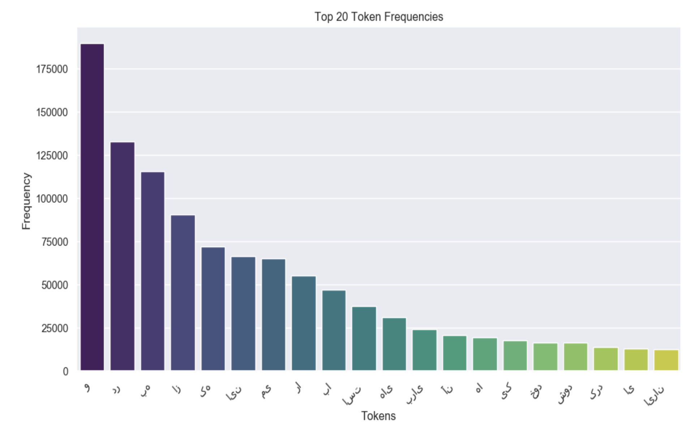
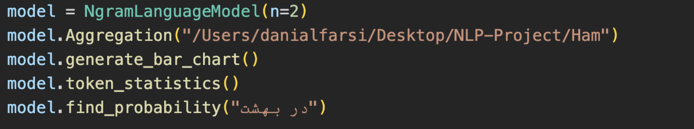
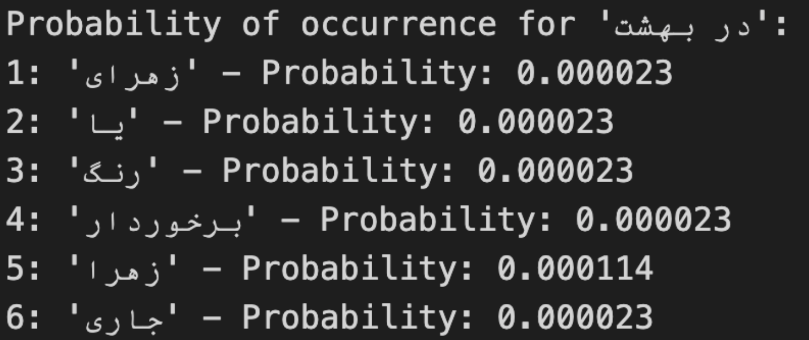

# N-gram Language Model

## Overview

This project aims to create a language model focused on the body of Hmashahri expressions, utilizing data cleaning methods for improved accuracy. The model is designed to receive an expression and predict the probability of its occurrence.

## Dataset - Hamshahri Corpus

The Hamshahri Corpus, a substantial Persian corpus based on the Iranian newspaper Hamshahri, serves as the foundation for this project. Originally compiled by Ehsan Darrudi at DBRG Group, the corpus was further enhanced by a team led by Ale Ahmad. It stands as the first Persian text collection suitable for information retrieval evaluation tasks.

## Most Common N-grams Repe11ons

| N-gram           | Count  |
|------------------|--------|
| در این           | 11,157 |
| می شود که در    | 10,525 |
| و در از این      | 8,712  |
| است که           | 5,915  |
| را به            | 5,579  |
| را در            | 4,879  |
| خود را           | 5,697  |

## Statistics

| Metric                  | Value       |
|-------------------------|-------------|
| Average Tokens per N-gram | 3.23        |
| Total Tokens            | 3,916,760   |
| Unique Tokens           | 88,056      |

## Input:

## Output:

